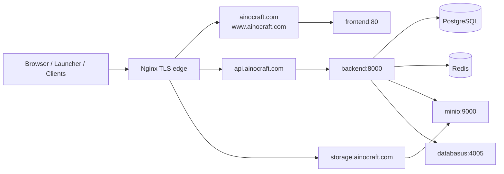

# AiNoCraft Deployment

<p align="center">
	
	
	
	
	
</p>

<p align="center">
	Infrastructure и edge-слой AiNoCraft: TLS-терминация, reverse proxy, storage и базовые stateful-сервисы для production-развёртывания.
</p>

## Обзор

`AiNoCraft_dep` - это не полный application stack и не monorepo-compose для всего проекта. Этот репозиторий отвечает за production-инфраструктуру вокруг AiNoCraft:

- Nginx как внешний reverse proxy и точка TLS-терминации;
- PostgreSQL, Redis и MinIO как базовые сервисы проекта;
- Databasus как отдельный сервис на локальном loopback-порту;
- единая docker-сеть `ainocraft_network`, в которую должны входить frontend и backend контейнеры.

Именно этот слой связывает публичные домены `ainocraft.com`, `api.ainocraft.com` и `storage.ainocraft.com` с внутренними сервисами проекта.

## Что входит в deployment-слой

| Сервис | Назначение | Внешний доступ |
| --- | --- | --- |
| `nginx` | HTTPS reverse proxy и маршрутизация по доменам | `80`, `443` |
| `postgres` | основная база данных | `127.0.0.1:5432` |
| `redis` | кэш, rate limit, state, токены | `127.0.0.1:6379` |
| `minio` | S3-compatible object storage | `127.0.0.1:9000`, console `127.0.0.1:9001` |
| `databasus` | дополнительный служебный сервис | `127.0.0.1:4005` |

## Архитектура



## Как маршрутизируется трафик

| Домен | Назначение | Куда проксируется |
| --- | --- | --- |
| `http://*` | любой HTTP-запрос | 301 redirect на HTTPS |
| `https://ainocraft.com` | frontend SPA | `frontend:80` |
| `https://www.ainocraft.com` | frontend SPA | `frontend:80` |
| `https://api.ainocraft.com` | backend API | `backend:8000` |
| `https://storage.ainocraft.com` | MinIO API / presigned uploads | `minio:9000` |
| `https://<IP>` | прямой HTTPS по IP | блокируется ответом `444` |

## Что важно знать до запуска

Этот репозиторий ожидает, что контейнеры приложений находятся в той же сети `ainocraft_network` и доступны по DNS-именам:

- `frontend`
- `backend`
- `minio`

С frontend всё уже согласовано: `AiNoCraft_front/docker-compose.prod.yml` поднимает сервис `frontend` в внешней сети `ainocraft_network`.

С backend есть важная особенность: текущий `AiNoCraft_back/docker-compose.yml` сам поднимает `postgres`, `redis` и `minio`, то есть он рассчитан на self-contained запуск и дублирует инфраструктуру из этого репозитория. Для production-модели с `AiNoCraft_dep` лучше запускать backend как отдельный контейнер или выделить из backend-compose только сервис `backend`.

## Требования к окружению

Перед стартом должны быть готовы:

1. Docker Engine и Docker Compose plugin.
2. DNS-записи на сервер:
	`ainocraft.com`, `www.ainocraft.com`, `api.ainocraft.com`, `storage.ainocraft.com`.
3. TLS-сертификаты в каталоге `/opt/ainocraft-project/ssl`.
4. Общий `.env` файл по пути `/opt/ainocraft-project/.env`.

Nginx-монтирование ожидает именно такие файлы сертификатов внутри контейнера:

- `/etc/nginx/ssl/fullchain.pem`
- `/etc/nginx/ssl/privkey.pem`
- `/etc/nginx/ssl/chain.pem`

## Быстрый старт

### Шаг 1. Поднять edge и shared infrastructure

В каталоге `AiNoCraft_dep`:

```bash
docker compose up -d --build
```

Это создаст сеть `ainocraft_network`, Nginx и stateful-сервисы.

### Шаг 2. Поднять frontend в той же сети

В каталоге `AiNoCraft_front`:

```bash
docker compose -f docker-compose.prod.yml up -d
```

Этот compose уже подключает сервис `frontend` к внешней сети `ainocraft_network`.

### Шаг 3. Поднять backend без дублирования infra

Рекомендуемый текущий подход - запускать только контейнер `backend`, не дублируя `postgres`, `redis` и `minio` из `AiNoCraft_back/docker-compose.yml`.

Минимальный пример backend-only compose:

```yaml
services:
  backend:
    image: ghcr.io/ainocraft/ainocraft-backend:latest
    container_name: backend
    restart: unless-stopped
    env_file:
      - /opt/ainocraft-project/.env
    ports:
      - "127.0.0.1:8000:8000"
    networks:
      - ainocraft_network

networks:
  ainocraft_network:
    external: true
```

После этого Nginx сможет резолвить `backend:8000` и маршрутизировать API-запросы на `api.ainocraft.com`.

## Переменные окружения

`AiNoCraft_dep` сам не хранит `.env.example`, но фактически использует один общий env-файл по пути `/opt/ainocraft-project/.env`.

Минимальные группы переменных, которые точно понадобятся:

| Группа | Для чего нужна |
| --- | --- |
| `POSTGRES_*` | база данных для backend и postgres-контейнера |
| `REDIS_*` | пароль и соединение для Redis |
| `MINIO_*` | креды и endpoint для object storage |
| `AUTH_*` | JWT и игровые токены backend-сервиса |
| `SMTP_*` | письма регистрации и сброса пароля |

Практический источник для начального шаблона - `AiNoCraft_back/.env.docker.example`.

> Важно: в текущем состоянии репозитория env-имена для application-layer и container-layer нужно сверить отдельно перед production rollout, особенно для `postgres` и `minio`, потому что образы сервисов и backend-приложение могут ожидать не полностью одинаковые имена переменных.

## Безопасность и сетевой периметр

| Механика | Как реализовано |
| --- | --- |
| HTTP -> HTTPS | глобальный 301 redirect |
| HTTPS по IP | блокируется через `return 444` |
| TLS | сертификаты монтируются из `/opt/ainocraft-project/ssl` |
| Базы и кеши | опубликованы только на `127.0.0.1` |
| Статика frontend | кэшируется через Nginx |
| Upload в MinIO | проксируется через отдельный домен `storage.ainocraft.com` |

## Структура репозитория

```text
docker-compose.yml     # edge + shared infrastructure
nginx/
	Dockerfile          # сборка nginx-образа с кастомным конфигом
	conf.d/
		default.conf     # HTTPS redirect, домены, proxy_pass и security headers
```

## Полезные команды

```bash
docker compose up -d --build
docker compose ps
docker compose logs -f nginx
docker compose logs -f postgres redis minio databasus
```

## Ограничения текущей схемы

- Этот репозиторий не поднимает frontend и backend автоматически.
- Nginx жёстко ожидает имена upstream-сервисов `frontend`, `backend` и `minio`.
- Production-схема сейчас распределена по нескольким репозиториям и не сведена в единый compose-файл.
- Для полного zero-to-prod сценария стоило бы добавить отдельный `backend-only` compose и шаблон `.env.example` прямо в этот репозиторий.

## Связанные части проекта

- `AiNoCraft_front` - production frontend container в сети `ainocraft_network`.
- `AiNoCraft_back` - backend image, API, authserver и бизнес-логика.
- `AiNoCraft_Launc` - desktop launcher, который использует `api.ainocraft.com` и `storage.ainocraft.com`.

Если нужно, следующим шагом можно собрать и единый production README на верхнем уровне всего workspace с рекомендованным порядком запуска всех частей проекта.